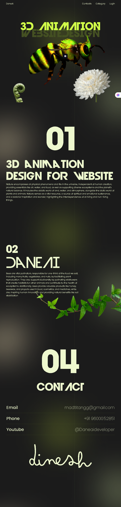

Here’s a clean **README.md** you can use for your GitHub repository. It explains your project (3D animated website using Three.js, GSAP, and HTML/CSS) and includes setup instructions:

---

# 3D Animated Website – DaneAI

This project is a **3D interactive website** built with [Three.js](https://threejs.org/), [GSAP](https://greensock.com/gsap/), and vanilla HTML/CSS/JS.
It features a **3D animated bee model** that moves and rotates as users scroll through different sections of the page.

## 🚀 Features

* Smooth **3D model rendering** using Three.js
* **GLTF model loading** with animations
* **Scroll-based interactions** powered by GSAP
* Responsive design with modern typography
* Styled with custom **CSS** for desktop & mobile

## 📂 Project Structure

```
├── index.html       # Main HTML file
├── style.css        # Styling and layout
├── app.js           # Three.js, GSAP, and animation logic
├── img/             # Decorative images (flower, leaf, etc.)
└── demon_bee_full_texture.glb  # 3D model (required in root folder)
```

## ⚙️ Installation & Setup

1. Clone this repository:

   ```bash
   git clone https://github.com/your-username/your-repo-name.git
   ```
2. Place your 3D model file (`demon_bee_full_texture.glb`) inside the project root.
3. Open `index.html` in your browser (no build tools required).

> 💡 For best results, run with a local server:

```bash
# Using Python
python -m http.server 8080
# Or using Node.js (if installed)
npx serve .
```

or use live server extention in vscode

Then visit `http://localhost:8080`.

## 📸 Demo




## 🛠️ Technologies Used

* **Three.js** – 3D rendering engine
* **GSAP** – Smooth animations
* **HTML5 & CSS3** – Structure & styling

## 📬 Contact

* Email: [madtitangg@gmail.com](mailto:danedie@gmail.com)
* Phone: +91 96000 52851
* YouTube: [@Daneaideveloper](https://youtube.com/@japanimelovers)

